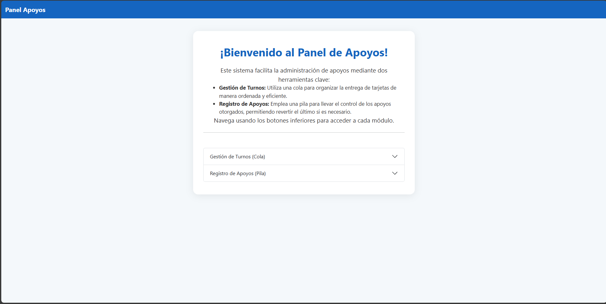
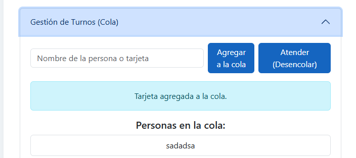
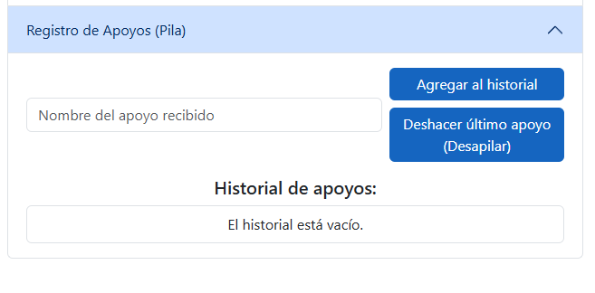

# Sistema de Apoyos (Pilas y Colas)

**Nombre:** Jorge de Jesus Priego Zapata

**Grupo y materia:** 8vo Semestre - Estrctura de Datos

**Docente** Kevin David Molina Cruz


## Descripción
Sistema web sencillo en Python usando Flask para gestionar:
- **Cola:** Entrega de tarjetas de apoyo (personas esperando su tarjeta).
- **Pila:** Historial de apoyos recibidos (simula deshacer apoyos).

## Estructura del proyecto
```
menuflask/
├── app.py
├── README.md
├── models/
│   ├── pila.py
│   └── cola.py
├── templates/
│   ├── menu.html
│   ├── cola.html
│   └── pila.html
```

## Guía visual de uso (3 pasos)

### Paso 1: Menú General



### Paso 2: Cola de Tarjetas



### Paso 3: Historial de Apoyos (Pila)



---
